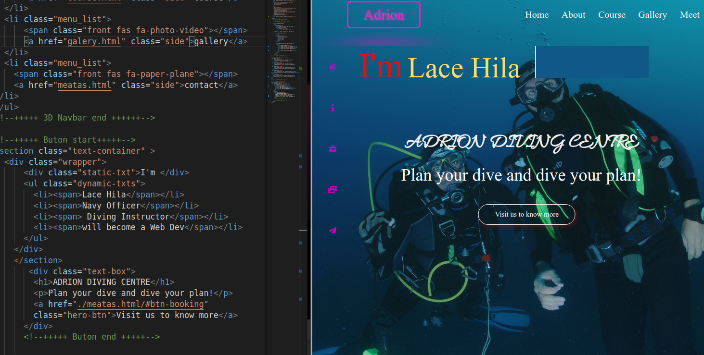
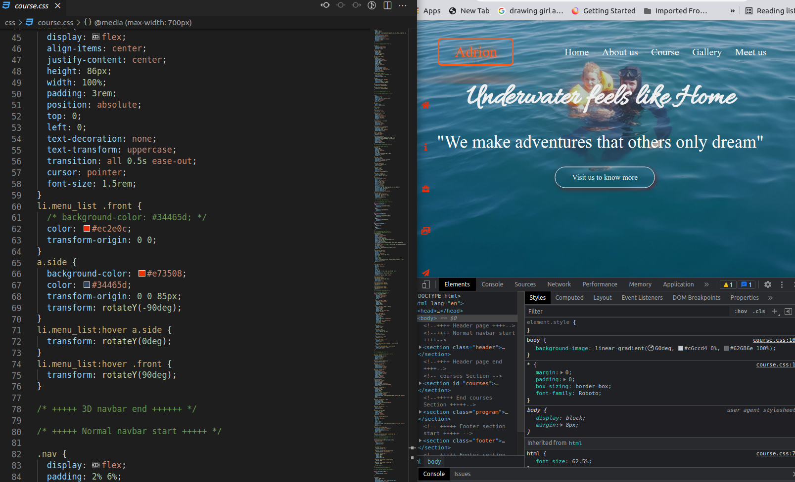
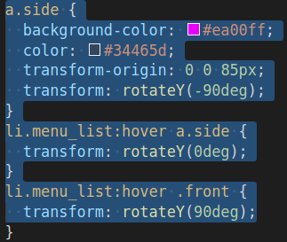

# UIB Final Project 
Adrion Diving Centre

## Project Disciption

 - This is my first project, after more than two months of learning HTML and CSS thanks to DCI teachers.
Since I have a diving background, I created a diving project, too. In this project I have used all my personal materials e.g. photos and texts.
- Since I have a diving background, I created a diving project. in this project I have used all my personal materials e.g. photos and texts.
Since it is an Entertainment Site I have used many colors, animations and hover.
I have also used many linked pages.
The whole site is responsive.

## Links

- [Repo](https://e06-2.github.io/uib-final-project-Adrion10/ "<Diving Centre> Repo")
- [Bugs](https://github.com/E06-2/uib-final-project-Adrion10/ "Adrion Divig Centre")

## Some Code

a.side {
  background-color: #ea00ff;
  color: #34465d;
  transform-origin: 0 0 85px;
  transform: rotateY(-90deg);
}
li.menu_list:hover a.side {
  transform: rotateY(0deg);
}
li.menu_list:hover .front {
  transform: rotateY(90deg);
## Screenshots
 
 
  
## Built With
- HTML
- CSS
- SCSS
## Author

**Lace Hilaj** student at DCI

- [Profile](https://github.com/Adrion10 "Lace Hilaj")
- [Email](lacehila@gmail.com?subject=Hi "Hi!")
- [Website](https://e06-2.github.io/uib-final-project-Adrion10/)

## 🤝 Support

Course teachers at DCI

Give a ⭐️ if you like this project!

